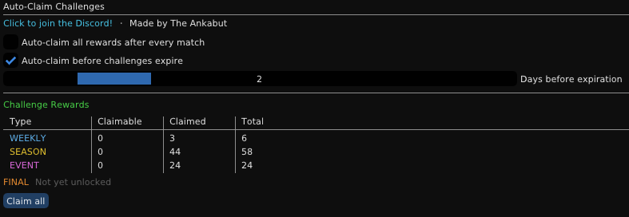

# Auto-Claim Challenges

Automatically claim your completed Rocket League challenges without navigating menus.

## Features

* Auto-claim completed Weekly, Season, and Event challenges when you return to the main menu.
* Days before expiry threshold to claim challenges about to expire.
* No popups or interruptions.
* Stats panel and manual Claim All button.

## How It Works

Each time you return to the main menu, the plugin checks for completed challenges and claims them based on your settings.

## Installation

1. Close Rocket League.
2. Download the ZIP from [Releases](https://github.com/TheAnkabut/AutoClaimChallenges/releases).
3. Extract the zip.
4. Run `install_AutoClaimChallenges.bat`.
5. Start Rocket League.

*This plugin sends a one-time request with user ID to count unique users.*

## Discord

Questions? Join the Discord.

## Support

If you found this plugin useful, any support is appreciated.

